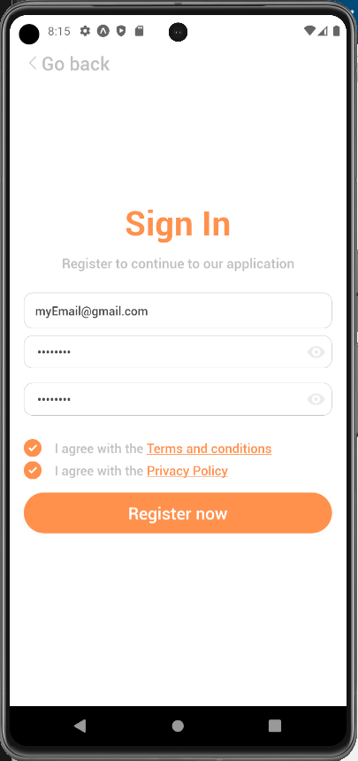

# myHealthApp

Welcome to my personal GitHub repository showcasing a proof-of-concept (POC) project: myHealthApp. Developed using React Native, this project represents my exploration into creating a comprehensive mobile application for health management. While it's a POC, the app is a mobile application for tracking health metrics, managing medication and accessing relevant health content. 

## Features

- **Cross-Platform Compatibility**: Developed for both Android and iOS devices, ensuring broad accessibility.
- **Health Metrics Tracking**: Record and visualize blood pressure and weight metrics over time.
- **Medication Management**: Track medications, set reminders, and mark doses taken daily.
- **Notification System**: Shows reminders for medications and daily health tasks, integrated into the app's notification center.
- **Community Engagement**: Access health articles and community resources: local parks, bike lanes, events, and local events.

## Demo Videos

  
  

  
  

  
  

## Screenshots

  
  
  

  
  
  

  
  
  

  
  

## Technologies and Libraries Used

- React Native
- Redux (for state management)
- React Navigation (for navigation)
- UI Kitten (for radio selection, dropdown, loading spinner and password input)
- React Native Paper (for report tables)
- react-native-chart-kit (for Charts)
- BouncyCheckbox (for animated checkboxes)
- YoutubeIframe (for youtube video display)
- Lodash (limiting the rate of function invocation)
- Moment (parsing, validating and formatting dates)

## Contact

For any inquiries or suggestions, feel free to reach out.